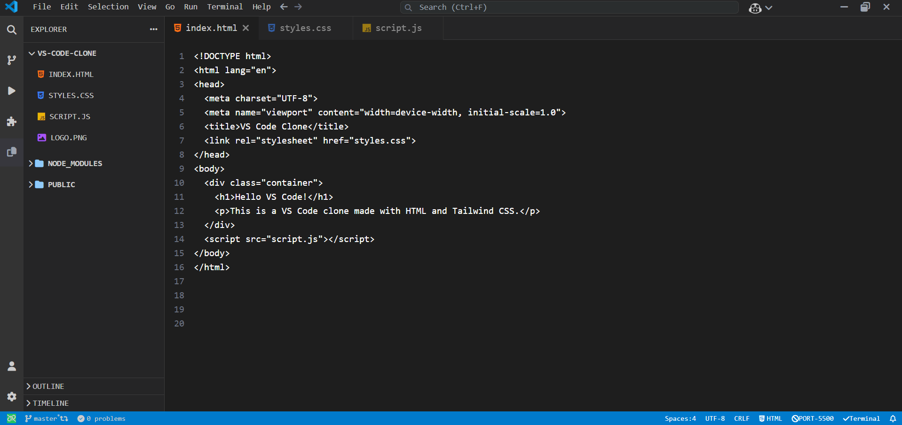

<div align="center">
  
  <h1>VS Code UI Clone</h1>
  <h4>A responsive code editor interface inspired by Visual Studio Code, built with 
      <a href="https://tailwindcss.com" target="_blank">Tailwind CSS</a> and HTML.</h4>

  <p>
    <a href="https://jatinsoni08.github.io/VSCode-UI/">View Live Demo</a> ·
    <a href="https://github.com/jatinsoni08/VSCode-UI/issues">Report Bug</a> ·
    <a href="https://github.com/jatinsoni08/VSCode-UI/issues">Request Feature</a>
  </p>

  <p>
    
    
    
    
  </p>

  <p>
    <a href="#key-features">Key Features</a> •
    <a href="#tech-stack">Tech Stack</a> •
    <a href="#installation">Installation</a> •
    <a href="#project-structure">Project Structure</a> •
    <a href="#preview">Preview</a> •
    <a href="#license">License</a>
  </p>

  <div style="display: flex; justify-content: center; gap: 20px; flex-wrap: wrap;">
    
  </div>
</div>

---

## ✨ Key Features

- **🖥️ Editor UI** – Clean design inspired by VS Code  
- **📂 Sidebar Layout** – File explorer styled UI  
- **🔎 Command Palette-like** – Modern developer feel  
- **📱 Fully Responsive** – Works on desktop, tablet, and mobile  
- **⚡ Tailwind Powered** – Built with utility-first CSS framework  

---

## 🛠️ Tech Stack

| Technology | Purpose |
|------------|---------|
|  **HTML5** | Semantic markup structure |
|  **Tailwind CSS** | Utility-first CSS framework |

---

## 🚀 Installation

1. **Clone the repository**
   ```bash
   git clone https://github.com/jatinsoni08/VSCode-UI.git
